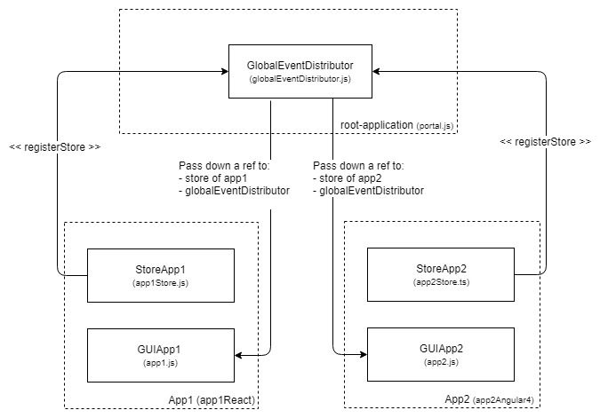

# single-spa-portal-example
The goal of this project is to provide an example of how to build a portal like app which consists of multiple single page applications (SPA's). Each SPA should be self contained with its own build process. It should be individually deployable without the need to deploy the whole application if there are changes to any individual app.

This example is based on [simple-single-spa-webpack-example](https://github.com/joeldenning/simple-single-spa-webpack-example/blob/master/README.md) but will provide further features like:

- [x] Isolate SPA's with their own build process
- [x] Load SPA's on demand with SystemJS
- [x] Provide a way to communicate between each SPA
- [x] Get assets (like images, fonts, css, etc.) coming from different servers to work
- [x] Support multiple Angular versions without zone.js conflicts. For details see [Multiple Angular Apps](#multiple-angular-apps)
- [x] Support Angular AOT Builds

## How to run this project
1. Clone this project
2. Jump into each app folder and do:
   - `npm install`
   - `npm run watch:portal`
3. Then start the portal with:
   - `npm install`
   - `npm run watch`
4. Open up http://localhost:9000 in a web browser.

## npm tasks
`watch:portal`: Builds the app as UMD module with singleSPA as middleware to consume the app by the portal. Changes are automatically detected.

`build:portal`: Releases the app as UMD module and outputs all contents to a folder. You can upload the produced file in production to your webserver. **Hint**: The Angular 6 example is being build with AOT. You can use `npm run build:portal -- --env.analyzeBundle` to see that there is no compiler.js inside the bundle.

`watch:standalone`: If you just want to develop the single app without the whole portal, you can use this task. Check the console log to see which port the app is being served from. This task is OPTIONAL! For now this task only exists on the Vue project to serve as an example.

`build:standalone`: As with the `watch:standlone` taks, this builds the app as stand alone version (no portal needed). This task is OPTIONAL! For now this task only exists on the Vue project to serve as an example.

## inter-app-communication
This topic has been discussed multiple times (i.e. [here](https://github.com/CanopyTax/single-spa/issues/112) or [here](https://github.com/CanopyTax/single-spa/issues/107)). There may be many solutions to solve this problem. In this repository I want you to show a solution that meets the following requirements:

- Each app is a self contained system. No app knows the internal state of another app or their data model. In short, each app is treated as a black box and can be maintained by a different team. 
- Each app must be able to have a complex state. 
- When you navigate between apps, the state must not be lost (because of mount/unmount).

To meet these requirements I have decided for an event system where each app can or can not listen to events that other apps send. This enables each app to keep their isolated state and modify only their own state based on events from other apps (and probably resend other events). No app needs direct access to the state of another app.

Furthermore I needed to split the apps into two parts. One is the normal app itself (GUI, Framework, etc.), the other is a "communication layer" which is exported as separate module and loaded/instantiated by the portal regardless of the app state. This allows each app to listen and react to events even if they aren't mounted.

Each app can process these events in whatever way they like. The only requirement is that all apps agree on one event format to send and receive these events.

For this example I have decided to just go with redux since it basically does exactly what I need. Throw events and process events. **But this system works with whatever technic you like.**

Here is a graphic which illustrates what actually happens:

### The main parts are:

**StoreApps:** Contains state + business logic. Implements a dispatch method which can be called by the GlobalEventDistributor if an global event occurs.

**GUIApps:** singleSPA middleware + UI code like HTML, CSS, Controller, etc. + Framework like React or Angular

**GlobalEventDistributor:** Can be used to register stores. Sends dispatch events to all stores. (Observer pattern)

### How it works:
1. The root-application boots and loads all stores and instantiates them. This is necessary since we need the communication layer (store) to be active at all times. Even if the whole application is not mounted yet. Otherwise no app specific events getting processed.
2. When an app is being mounted, the root-application passes the already instantiated store belonging to the individual app down. The root-application also passes a reference to the GlobalEventDistributor to the app. 
3. Now you can happily send all your global events to the GlobalEventDistributor with the dispatch() method and all other events to the local store.

### Cons:
As already mentioned, the biggest disadvantage is that all stores have to be loaded when the root-application loads. The reason for this is that we are building a project that will have a huge application state being entirely in the browser. The user will likely input 1h of data without any server communication and once he is done, he will save everything with one click. 
This must not necessarily be your use-case. For example if you are only interested in inter-app-communication with any currently active app, you may not need to load all states beforehand but rather load them while the apps mount.  

## Multiple Angular Apps
The big issue with Angular 2+ is, that it (or third party libraries which Angular depends on) pollute the global window object. One such library is Zone.js. Zone.js monkey patches all async events and add its reference to the window object. If you have multiple Angular apps running, Angular will complain that Zone.js is already loaded.

One possible solution is to separate Zone.js from all Angular apps and load Zone.js only once in the portal. This may not be the best solution because as soon as you have multiple different Angular versions as apps in the portal, it may be possible that some of them require different Zone.js versions. Which may break everything at that point. Even though it is not a great solution, it may be the best solution we have with the current state of angular.

The other solution I found is to load every Angular app in its own iframe. Doing that, every Angular app runs completely isolated. You can then set the render target for Angular to the parent window. With this solution Angular runs in a complete isolated context but renders all content to the main DOM. Sadly this is also not the perfect solution since you open up many other issues you have to deal with. A few examples are: 
- You need to manually put all CSS styles from the iframe to the parent window 
- The angular router can no longer access the browser URL to update it according to the app routing 
- You can't use third party UI libraries that depent on document events. (i.e. a dropdown component that wants to know when you click on the document to close it.) 

In the future we may have better solutions like Angular elements to deal with this issue, until then our best bet is to put a single Zone.js instance into the portal app. Which is exactly what I did in this example project.

## Forks
- https://github.com/tsukhu/single-spa-portal-monorepo (If you plan to use a monorepo with multiple apps maintained by the same team, you may be interested in this fork which integrates yarn workspaces + lerna to simplify the development process. For more details see: [here](https://github.com/me-12/single-spa-portal-example/issues/45))

